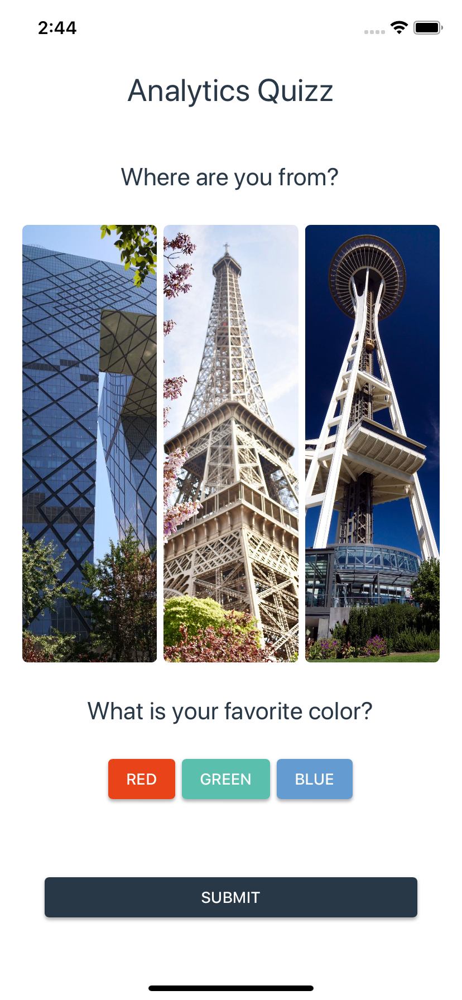
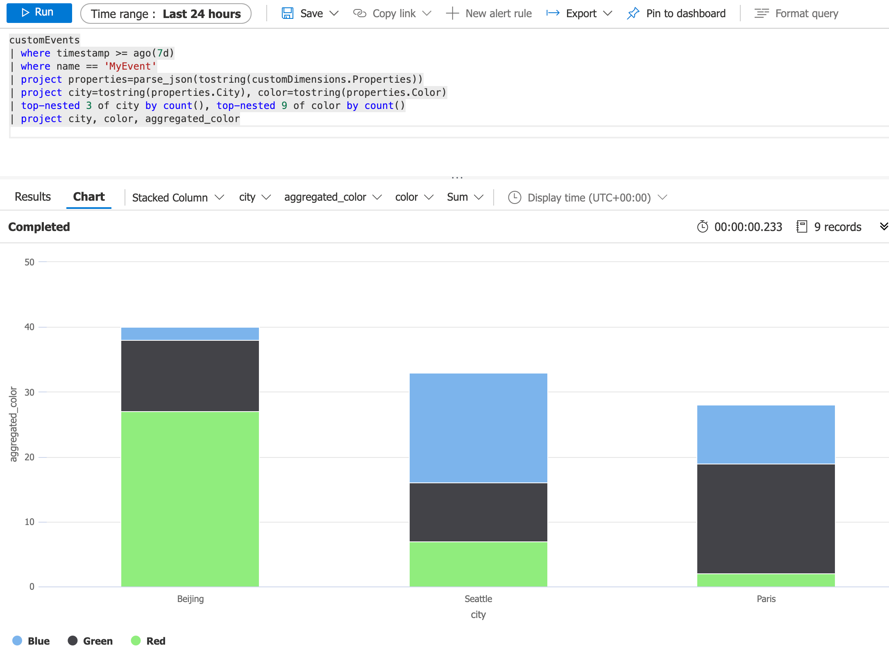

The purpose of this project use to demonstrate the use of Application Insights to show Analytics data coming from App Center.

## Configuring the export

For more information on how to configure the export :

[https://johnthiriet.com/mobile-analytics-with-app-center-and-application-insights/](https://johnthiriet.com/mobile-analytics-with-app-center-and-application-insights/)

Analytics data might need **several minutes** to flow from AppCenter to Application Insights. Please be patient the first time you do your tests.



## Application Insights

This is a sample request that can be used to query the data in Application Insights.

```
customEvents
| where timestamp >= ago(7d)
| where name == 'MyEvent'
| project properties=parse_json(tostring(customDimensions.Properties))
| project city=tostring(properties.City), color=tostring(properties.Color)
| top-nested 3 of city by count(), top-nested 9 of color by count()
| project city, color, aggregated_color
```




## PowerBI

Additionnaly, data exported to Application Insights can be shown in a PowerBI dashboard like displayed here :

[https://app.powerbi.com/view](https://app.powerbi.com/view?r=eyJrIjoiOTU4YmI0YmMtNmE3OS00YmRkLTk5NmMtNWU3MDc3ZGRhYTA1IiwidCI6IjFlZGQ1MDMzLWViMWQtNGU2NS04MjNjLTQ2YTFkYTQzMzliNiJ9)